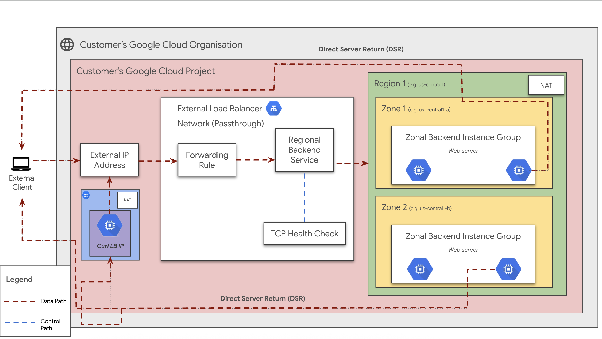

# Network Passthrough External Load Balancer User Guide

## **Table of Contents**

1.  [Introduction](#introduction)
2.  [Objectives](#objectives)
3.  [Architecture](#architecture)
4.  [Request Flow](#request-flow)
5.  [Architecture Components](#architecture-components)
6.  [Deploy the Solution](#deploy-the-solution)
7.  [Prerequisites](#prerequisites)
8.  [Deploy with "single click"](#deploy-with-single-click)
9.  [Deploy through Terraform-cli](#deploy-through-terraform-cli)
10. [Optional - Delete the Deployment](#optional-delete-the-deployment)
11. [Troubleshoot Errors](#troubleshoot-errors)
12. [Submit Feedback](#submit-feedback)

## **Introduction**

This document provides a comprehensive guide for implementing a [Network Passthrough External Load Balancer](https://cloud.google.com/load-balancing/docs/passthrough-network-load-balancer) (NLB) using Google Cloud. This type of load balancer is ideal for TCP, UDP, and ESP traffic, offering high performance and low latency by passing network packets directly to backend instances.

The guide assumes familiarity with Google Cloud Platform (GCP) and Terraform.

## **Objectives**

This solution guide helps you to:

* Set up a Network Passthrough Load Balancer to distribute TCP, UDP, or ESP traffic.
* Achieve high performance and low latency for your applications.
* Automate deployment using Terraform.
* Understand the architecture and request flow of the network passthrough load balancing solution.

## **Architecture**

This solution deploys a regional Network Passthrough External Load Balancer. The architecture consists of the following key components within a Customer's Google Cloud Project, residing within a Customer's Google Cloud Organisation:

<p align="center">
  
</p>

* **External Client:** Initiates traffic towards the application.
* **External IP Address:** The public IP address associated with the Forwarding Rule of the Network Passthrough Load Balancer.
* **External Load Balancer (Network Passthrough):** Operates at the network layer (Layer 4) and distributes incoming traffic to backend instances without proxying the connection. This deployment uses a *regional* NLB.
* **Forwarding Rule:** Directs incoming traffic based on IP address, protocol, and port to the Regional Backend Service.
* **Regional Backend Service:** Defines the backend instances (in this case, within a Regional Managed Instance Group) that will receive traffic. It also manages health checks.
* **Zonal Backend Instance Groups:** Managed Instance Groups (MIGs) deployed across multiple zones within a region (e.g., `us-central1-a`, `us-central1-b`). These groups contain the backend web servers.
* **TCP Health Check:** Periodically probes the backend instances to determine their health and availability. Traffic is only sent to healthy instances.
* **NAT (Network Address Translation):** While not directly part of the NLB's data path, NAT might be used for outbound internet access from the backend instances.
* **Direct Server Return (DSR):** The diagram indicates a Direct Server Return path (dashed red lines). This is an advanced configuration where backend instances send responses directly to the client, bypassing the load balancer for egress traffic. This can improve performance and reduce latency.

### **Request Flow**

The flow of a request through this Network Passthrough External Load Balancer setup is as follows:

1.  **Client Request:** An `External Client` sends a TCP/UDP/ESP request to the `External IP Address` of the load balancer on a specific port.
2.  **Forwarding Rule:** The `Forwarding Rule` receives the traffic and, based on its configuration (IP address, protocol, port), directs it to the associated `Regional Backend Service`.
3.  **Load Balancer Distribution:** The Network Passthrough Load Balancer distributes the incoming packets to a healthy instance within one of the `Zonal Backend Instance Groups` that are part of the `Regional Backend Service`. The load balancer makes a direct connection to the backend instance without acting as a full proxy.
4.  **Backend Processing:** The selected backend instance (a `Web server`) processes the request.
5.  **Response (Direct Server Return - Optional):** As indicated by the `Direct Server Return (DSR)` path, the backend instance can send the response directly back to the `External Client`, bypassing the load balancer for the return traffic. This requires specific configuration on the backend instances and the network. If DSR is not configured, the response will typically return through the load balancer.
6.  **Health Checks:** Concurrently, the `TCP Health Check` probes the backend instances at regular intervals to ensure they are healthy and responsive. Instances failing the health check are temporarily removed from the pool of available backends.

### **Architecture Components**

* **Client:** The user or system sending traffic to your application.
* **External IP Address:** The public IP address for accessing the load-balanced application.
* **Network Passthrough External Load Balancer:** The regional load balancer distributing network traffic at Layer 3/4.
* **Forwarding Rule:** Directs incoming traffic to the backend service based on configured criteria.
* **Regional Backend Service:** Manages the backend instances and their health.
* **Zonal Backend Instance Groups (MIGs):** Groups of identical virtual machine instances in different zones within a region, serving the application.
* **TCP Health Check:** Monitors the health of the backend instances.
* **Direct Server Return (DSR):** An optional configuration allowing backend instances to send responses directly to clients.

## **Deploy the Solution**

This section provides instructions on deploying the load balancer solution using Terraform.

### **Prerequisites**

For this configuration, ensure the following are installed:

1.  **Terraform:** Modules are for use with Terraform 1.8+ and tested using Terraform 1.8+.  Install from [Terraform Downloads](https://releases.hashicorp.com/terraform/).
2.  **gcloud SDK:** Install the gcloud SDK from [Google Cloud SDK Documentation](https://cloud.google.com/sdk/docs/install) to authenticate to Google Cloud while running Terraform.

### **Deploy with "single click" (Using Cloud Shell and Cloud Build)**

This method uses Google Cloud Shell and Cloud Build to automate the deployment of the Network Passthrough External Load Balancer.

1.  **Open in Cloud Shell:** Click the button below to clone the repository and open the necessary configuration files in the Cloud Shell editor.

    <a href="https://ssh.cloud.google.com/cloudshell/editor?shellonly=true&cloudshell_git_repo=https://github.com/GoogleCloudPlatform/cloudnetworking-config-solutions.git&cloudshell_workspace=.&cloudshell_open_in_editor=configuration/bootstrap.tfvars,configuration/organization.tfvars,configuration/networking.tfvars,configuration/security/mig.tfvars,execution/06-consumer/MIG/config/instance.yaml.example,execution/07-consumer-load-balancing/Network/Passthrough/External/config/instance-lite.yaml.example&cloudshell_tutorial=docs/LoadBalancer/external-network-passthrough-lb-mig.md#deploy-with-single-click" target="_new">
        
    </a>

2.  **Review and Update Configuration Files:**
    The Cloud Shell editor will open the following key configuration files. Review each file and update the values (especially project IDs, user IDs/groups, network names, regions, VPC names, subnet names, etc.) as per your requirements. Follow the detailed guidance provided in the "Deploy through Terraform-cli" section for each specific file:
    * `configuration/bootstrap.tfvars` (Crucial for initial setup, ensure it's correct if you plan to automate the bootstrap stage via Cloud Build, which is commented out by default in `cloudbuild-nlb.yaml`.)
    * `configuration/organization.tfvars`
    * `configuration/networking.tfvars`
    * `configuration/security/mig.tfvars`
    * `execution/06-consumer/MIG/config/instance.yaml.example` (Rename to `instance.yaml` in the same directory after updating its contents.)
    * `execution/07-consumer-load-balancing/Network/Passthrough/External/config/instance-lite.yaml.example` (Rename to `instance-lite.yaml` in the same directory after updating its contents.)

3.  **Run NLB Prerequisites Script:**
    This script prepares your Google Cloud project by enabling necessary APIs, creating a Terraform state bucket specifically for this NLB deployment, and setting IAM permissions for Cloud Build. From the root of the cloned `cloudnetworking-config-solutions` directory in Cloud Shell, run:
    ```bash
    sh docs/LoadBalancer/helper-script/prereq-nlb.sh
    ```
    When prompted, enter the Google Cloud Project ID where you want to deploy the solution.

4.  **Submit Cloud Build Job to Deploy NLB:**
    Once configuration files are updated and the prerequisites script has been successfully executed, submit the Cloud Build job. This will trigger Terraform to provision the resources. Ensure you are in the root of the cloned repository.
    ```bash
    gcloud builds submit . --config docs/LoadBalancer/build/cloudbuild-nlb.yaml --project YOUR_PROJECT_ID
    ```
    Replace `YOUR_PROJECT_ID` with your actual Google Cloud Project ID (this should be the same project ID used in the `prereq-nlb.sh` script and your `.tfvars` files).

5.  **Verify Deployment:**
    After the Cloud Build job completes successfully, navigate to the "Load Balancing" section in the Google Cloud Console. Confirm that your Network Passthrough Load Balancer has been created and that the Managed Instance Group (MIG) is correctly attached as a backend and is healthy.

6.  **[Optional] Delete the Deployment using Cloud Build:**
    To remove all resources provisioned by this NLB deployment via Cloud Build, run the corresponding destroy job:
    ```bash
    gcloud builds submit . --config docs/LoadBalancer/build/cloudbuild-nlb-destroy.yaml --project YOUR_PROJECT_ID
    ```
    Replace `YOUR_PROJECT_ID` with your Google Cloud Project ID.

### **Deploy through Terraform-cli**

1.  Clone the repository containing the Terraform configuration files:

    ```bash
    git clone https://github.com/GoogleCloudPlatform/cloudnetworking-config-solutions.git
    ```

2.  Navigate to **cloudnetworking-config-solutions** folder and update the files containing the configuration values

   * **00-bootstrap stage**
     * Update `configuration/bootstrap.tfvars` and update the google cloud project IDs and the user IDs/groups in the tfvars.

        ```
        bootstrap_project_id                      = "your-project-id"
        network_hostproject_id                    = "your-project-id"
        network_serviceproject_id                 = "your-project-id"
        organization_stage_administrator          = ["user:user-example@example.com"]
        networking_stage_administrator            = ["user:user-example@example.com"]
        security_stage_administrator              = ["user:user-example@example.com"]
        producer_stage_administrator              = ["user:user-example@example.com"]
        producer_connectivity_stage_administrator = ["user:user-example@example.com"]
        consumer_stage_administrator              = ["user:user-example@example.com"]
        consumer_lb_administrator                 = ["user:lb-user-example@example.com"]
        ```

   * **01-organisation stage**
     * Update `configuration/organization.tfvars` and update the google cloud project ID and the list of the APIs to enable.

        ```
        activate_api_identities = {
          "project-01" = {
            project_id = "your-project-id",
            activate_apis = [
              "servicenetworking.googleapis.com",
              "iam.googleapis.com",
              "compute.googleapis.com",
              ],
          },
        }
        ```
   * **02-networking stage**

     * Update `configuration/networking.tfvars` and update the Google Cloud Project ID and the parameters for additional resources such as VPC, subnet, and NAT as outlined below.

        ```
        project_id  = "your-project-id",
        region      = "us-central1"

        ## VPC input variables
        network_name = "CNCS_VPC"
        subnets = [
          {
            ip_cidr_range = "10.0.0.0/24"
            name          = "CNCS_VPC_Subnet_1"
            region        = "us-central1-a"
          }
        ]
        psa_range_name    = range1
        psa_range         = "10.0.64.0/20"

        ## PSC/Service Connectivity Variables
        create_scp_policy      = false # Use true or false based on your requirements
        subnets_for_scp_policy = [""]  # List subnets here from the same region as the SCP

        ## Cloud Nat input variables
        create_nat = false # Use true or false 

        ## Cloud HA VPN input variables

        create_havpn = false
        peer_gateways = {
        default = {
            gcp = "" # e.g. projects/<google-cloud-peer-projectid>/regions/<google-cloud-region>/vpnGateways/<peer-vpn-name>
        }
        }

        tunnel_1_router_bgp_session_range = ""
        tunnel_1_bgp_peer_asn             = 64514
        tunnel_1_bgp_peer_ip_address      = ""
        tunnel_1_shared_secret            = ""

        tunnel_2_router_bgp_session_range = ""
        tunnel_2_bgp_peer_asn             = 64514
        tunnel_2_bgp_peer_ip_address      = ""
        tunnel_2_shared_secret            = ""

        ## Cloud Interconnect input variables

        create_interconnect = false

        ## NCC input variables

        create_ncc = false

        ```

   * **03-security stage**

     * Update `configuration/security/mig.tfvars` file and update the Google Cloud Project ID. This will facilitate the creation of essential firewall rules, granting required MIG firewall rules for health checks.

        ```
        project_id = "your-project-id"
        network    = "CNCS_VPC"
        ingress_rules = {
        fw-allow-health-check = {
            deny               = false
            description        = "Allow health checks"
            destination_ranges = []
            disabled           = false
            enable_logging = {
            include_metadata = true
            }
            priority = 1000
            source_ranges = [
                "130.211.0.0/22",
                "35.191.0.0/16"
            ]
            targets = ["allow-health-checks"]
            rules = [{
            protocol = "tcp"
            ports    = ["80"]
            }]
        }
        }
        ```

   * **06-consumer stage**

     * Update the `execution/06-consumer/MIG/config/instance.yaml.example` file and rename it to `instance.yaml`.

        ```yaml
        name: minimal-mig
        project_id: 
        location: us-central1
        zone : us-central1-a
        vpc_name : CNCS_VPC
        subnetwork_name : CNCS_VPC_Subnet_1
        ```
        
   * **07-consumer-load-balancing stage**

     * Update the `execution/07-consumer-load-balancing/Network/Passthrough/External/config/instance-lite.yaml.example` file and rename it to `instance-lite.yaml`

        ```yaml
        name: lite-nlb
        project: <your-project-id>
        region: us-central1
        network: CNCS_VPC
        backend:
          - group_name: minimal-mig
        ```

3.  **Execute the Terraform script**

    You can deploy the stages individually using `run.sh` or deploy all stages automatically. Navigate to the `execution/` directory and run:

    ```bash
    ./run.sh -s all -t init-apply-auto-approve
    ```

    **or**
    
    ```
    ./run.sh --stage all --tfcommand init-apply-auto-approve
    ```

4.  **Verify Load Balancer Creation:**

    Once deployment is complete, go to the Load Balancing section in the Google Cloud Console to confirm your load balancer is created and the Managed Instance Group is attached as a backend.

## **Optional-Delete the deployment**

1.  In Cloud Shell or your terminal, ensure the current working directory is `$HOME/cloudshell_open/<Folder-name>/execution`.
2.  Remove provisioned resources:

    ```
    ./run.sh -s all -t destroy-auto-approve
    ```

3.  When prompted, enter `yes`.

### **Troubleshoot Errors**

Check Terraform's logs and output for errors.

## **Submit feedback**

To submit feedback:

* For assistance with streamlining network configuration automation, submit an issue on the [GitHub repository](https://github.com/GoogleCloudPlatform/cloudnetworking-config-solutions/issues).
* For unmodified Terraform code issues, create issues in the [GitHub repository](https://github.com/GoogleCloudPlatform/cloudnetworking-config-solutions/issues).
* For issues with the Google Cloud products used, contact [Cloud Customer Care](https://cloud.google.com/support-hub).